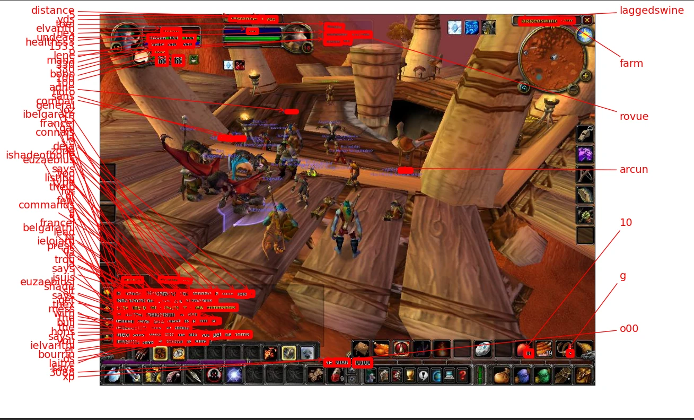
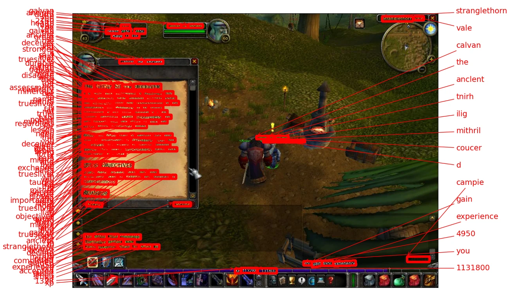

WoW Screenshot OCR
==============

Deep learning OCR models to read text from WoW screenshots. Based on a detector that spots text frames from screenshots, and a recognizer that reads text from detected frames.

- Chat
- Combat log
- Nameplates
- UI frames
- Map

Installation
-----

### ```pip install wow-ocr```


Usage
----

Models will use pre trained weights, you don't have to train anything. [Try it on Colab](https://colab.research.google.com/drive/1w4YIS--7qSzdSrwKPcQfqO988PlrxuCM?usp=sharing)

```
import wow_ocr

# Init pipeline, detector and recognizer models with pre trained weights
pipeline = wow_ocr.pipeline.Pipeline()


# Screenshots example
images = [
    wow_ocr.tools.read(url)
    for url in [
        "https://image_url.com/1.jpg",
        "https://image_url.com/2.jpg",
    ]
]

# Results - Image to Text
prediction_groups = pipeline.recognize(images)
# # Each list of predictions in prediction_groups is a list of
# # (word, box) tuples.

```



